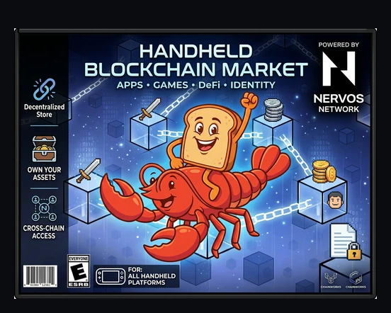

# Nervos Launcher

Nervos Blockchain App Store for retro gaming handhelds. Install and manage the CKB light client, explore blocks, connect to peers, and run Nervos dApps — all from your handheld's Ports menu.



## What It Does

A pygame-based app that runs as an EmulationStation port. Self-bootstrapping — just drop the launcher script on your device and it downloads everything from GitHub on first run.

**Screens:**
- **Home** — Dashboard with live sync status, block height, peer count
- **Explorer** — Tip header details, epoch, timestamps, hashes
- **Peers** — Connected peers list with drill-down detail view
- **Settings** — Install/update light client, start/stop service, boot toggle, config/log viewer
- **Terminal** — Mini shell with quick commands, scrollback, command history
- **Button Mapping** — First-boot gamepad configuration (d-pad, thumbstick, face buttons)

**Built-in installer** — downloads the CKB light client binary directly from GitHub releases. No SSH or PC required after initial setup.

## Install on Your Handheld

### Option 1: One-file install (easiest)

SSH into your device and run:

```bash
mkdir -p /userdata/roms/ports
curl -fsSL -o /userdata/roms/ports/Nervos-Launcher.sh \
  https://raw.githubusercontent.com/toastmanAu/nervos-launcher/main/Nervos-Launcher.sh
chmod +x /userdata/roms/ports/Nervos-Launcher.sh
```

Reboot or refresh gamelists. Launch "Nervos-Launcher" from Ports. It downloads the app on first run.

### Option 2: Remote deploy script

From your PC, deploy to any device over SSH:

```bash
./deploy.sh --host 192.168.1.50 --user root
```

### Option 3: Manual

Copy the repo contents to `/userdata/ckb-light-client/nervos-launcher/` on your device.

## Controls

Configured on first launch via the button mapping screen.

| Action | Default |
|--------|---------|
| Navigate | D-pad / Thumbstick |
| Confirm | A |
| Back | B |
| Home | Start |
| Terminal shortcut | Select |
| Quick commands (terminal) | L1 / R1 |
| Clear terminal | X |
| Command history | Y |
| Exit app | Select + Start |

## Compatible Devices

Any Linux handheld or SBC with arm64 or x86_64, pygame, and SSH access.

### Tier 1 — Easiest

| Device | Arch | RAM | OS |
|--------|------|-----|----|
| Raspberry Pi 4/5 | arm64 | 2–8GB | Raspberry Pi OS |
| Orange Pi 5 | arm64 | 4–32GB | Ubuntu, Armbian |
| Steam Deck | x86_64 | 16GB | SteamOS |

### Tier 2 — High-RAM handhelds

| Device | Arch | RAM | CFW |
|--------|------|-----|-----|
| Retroid Pocket 5/6 | arm64 | 6–16GB | ROCKNIX |
| Ayn Odin 2 | arm64 | 8–16GB | ROCKNIX |
| GameForce Ace | arm64 | 8–12GB | ROCKNIX |

### Tier 3 — 2GB handhelds

| Device | Arch | RAM | CFW |
|--------|------|-----|-----|
| Anbernic RG353 series | arm64 | 2GB | ROCKNIX, ArkOS |
| Powkiddy X55 | arm64 | 2GB | ROCKNIX |

### Tier 4 — 1GB handhelds (tested)

| Device | Arch | RAM | CFW |
|--------|------|-----|-----|
| **Anbernic RG35XX H** | arm64 | 1GB | Knulli |
| Anbernic RG35XX Plus/SP | arm64 | 1GB | Knulli, ROCKNIX |
| Powkiddy RGB30 | arm64 | 1GB | ROCKNIX |
| TrimUI Smart Pro | arm64 | 1GB | Knulli |

### Not Compatible

| Device | Reason |
|--------|--------|
| Miyoo Mini / Plus | arm32 only |
| Anbernic RG35XX (2023) | 32-bit firmware |

## Verification

After deployment, generate a health report (saved locally, not on device):

```bash
./verify.sh --host 192.168.68.110 --user root
```

Reports saved to `tested/` as markdown.

## Architecture

```
nervos-launcher/
├── launcher.py              # Entry point, page registration
├── lib/
│   ├── ui.py                # App, Page, ScrollList, theme, widgets
│   ├── rpc.py               # Light client RPC wrapper + background poller
│   └── installer.py         # Download engine with live progress
├── screens/
│   ├── home.py              # Dashboard
│   ├── explorer.py          # Block explorer
│   ├── peers.py             # Peer list + detail view
│   ├── settings.py          # Service management + installer
│   ├── terminal.py          # Mini shell
│   ├── text_viewer.py       # Generic scrollable text
│   ├── install_progress.py  # Live install progress
│   └── button_map.py        # First-boot input configuration
├── assets/                  # Box art, images
├── deploy.sh                # Remote SSH deployer
├── verify.sh                # Health check report generator
└── tested/                  # Verified device reports
```

**Adding a new screen:** Create a file in `screens/`, subclass `Page`, register in `launcher.py`. The page system handles navigation stack (push/pop), input routing, and lifecycle.

## Testnet Only

This is currently **testnet only** — no mainnet support until thoroughly tested.

## Roadmap

- [ ] Plugin manifest (JSON) for installable dApp modules
- [ ] dApp Store screen with images, descriptions, install/uninstall
- [ ] FiberQuest module (RetroArch tournaments with Fiber payments)
- [ ] Wallet module (watch addresses, check balances)
- [ ] DOB viewer (display Spore NFTs)
- [ ] PortMaster submission for one-tap install

## Community

- [Nervos Nation Telegram](https://t.me/NervosNation)
- [Wyltek Industries](https://wyltekindustries.com)
- [GitHub](https://github.com/toastmanAu)

## License

MIT
